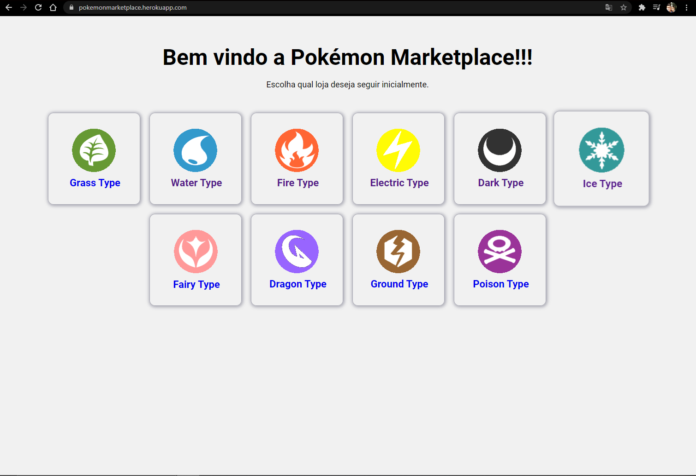
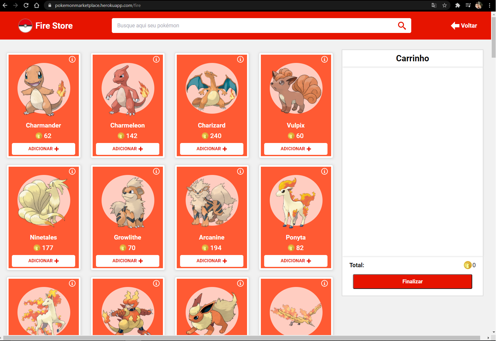
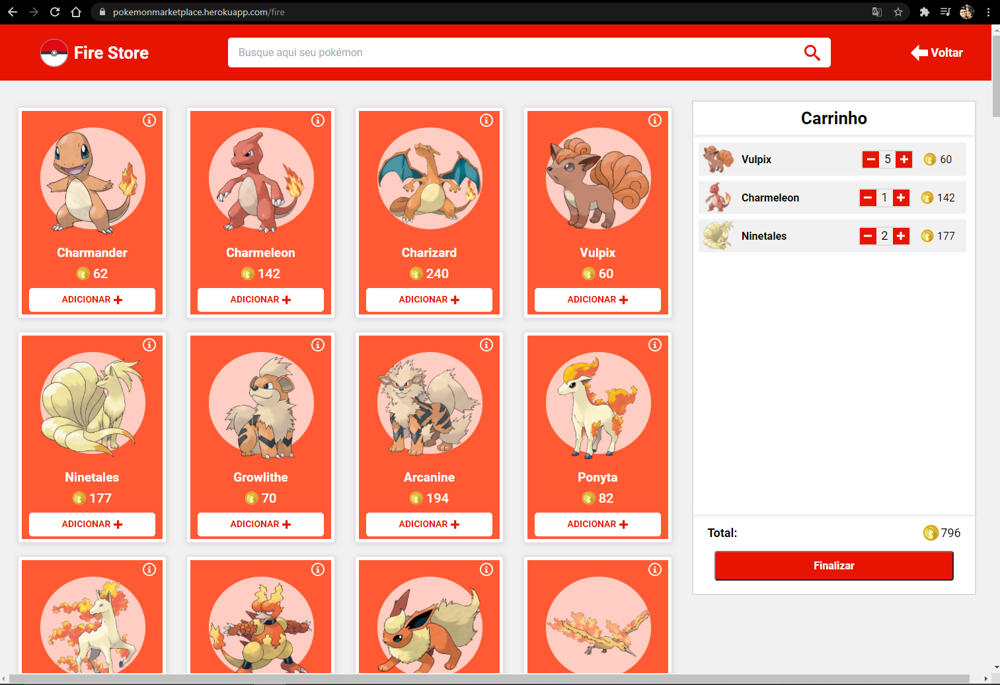
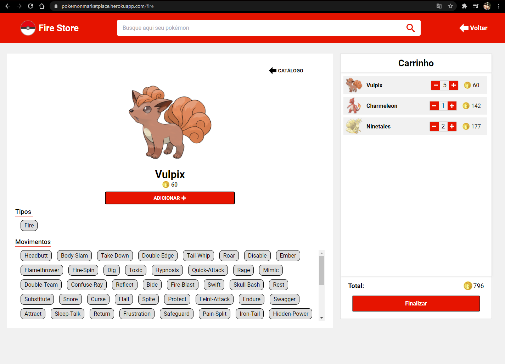
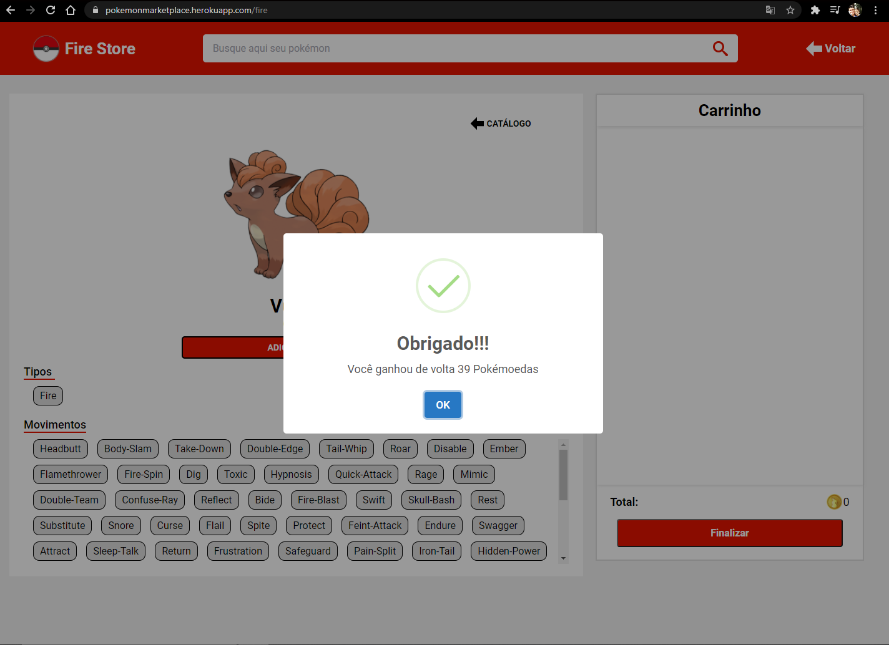
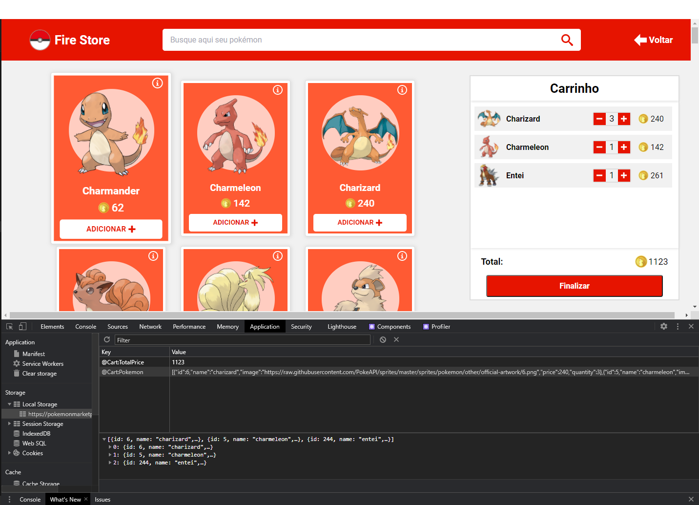
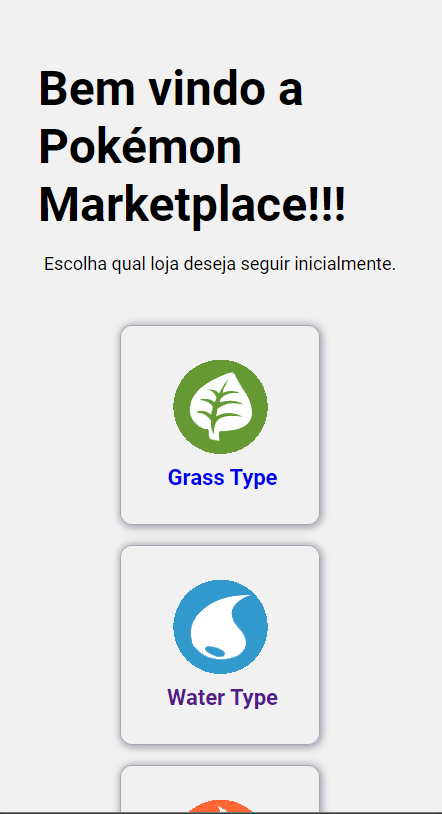
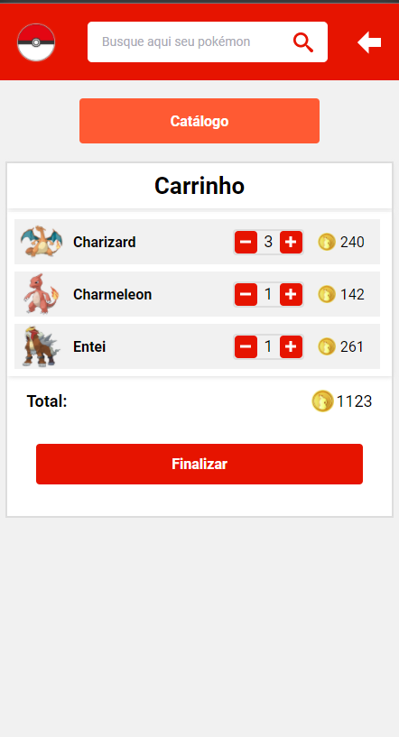
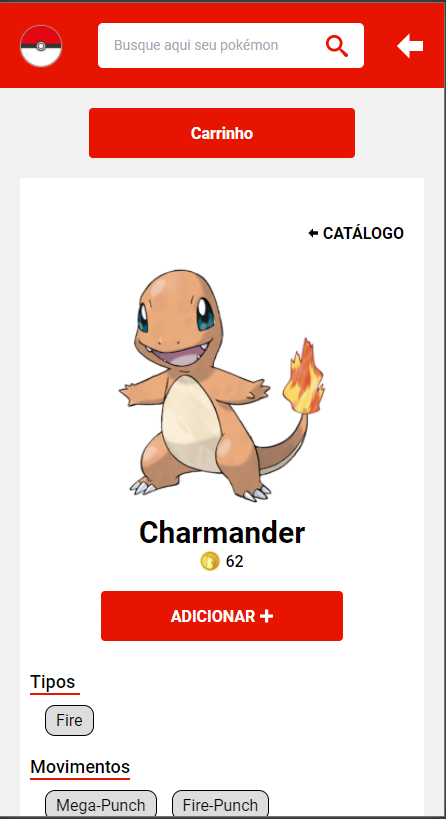
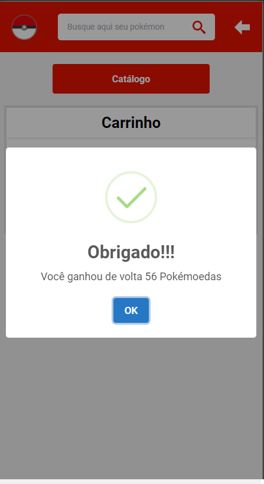

<div class="bg-gray-dark">
  <h1 align="center">
    Pokémon Marketplace
  </h1>
</div>

<p align="center">
  <a href="https://www.linkedin.com/in/carloseac/">
    
  </a>

  

  <a href="https://github.com/CarlosEduAC/Pokemon-Marketplace/commits/main">
    
  </a>

  

  <a href="https://github.com/CarlosEduAC/Pokemon-Marketplace/stargazers">
    
  </a>
</p>

<div align="center">
  <sub>Desafio FrontEnd B2W. Construído por
    <a href="https://github.com/CarlosEduAC">Carlos Eduardo Cardoso</a>
  </sub>
</div>

## :pushpin: Tabela de Conteúdo

<!-- * [Site de Demostração](#eyes-site-de-demostração)  -->
* [Sobre](#one-sobre-o-projeto)
* [Tecnologias](#two-tecnologias)
* [Funcionalidades](#three-funcionalidades)
* [Como rodar](#construction_worker-como-rodar)
* [Licencia](#closed_book-licencia)

## :one: Sobre o Projeto
Construção de uma [Pokémon Marketplace](https://pokemonmarketplace.herokuapp.com/) composta por lojas
representadas pelos tipos dos Pokémon. Cada loja deve ter um catálogo de Pokémon com a opção de adicionar no carrinho, remover do carrinho, mais detalhes sobre o pokémon, com preço definido de acordo com o nível do pokémon. O carrinho é compartilhado entre as lojas e gerenciado pela Pokémon Marketplace. Todas as informações sobre os Pokémon, foram obtidas pela API pública de [Pokémon](https://pokeapi.co/).

O projeto segue boas práticas e está disponivel no link [Pokémon Marketplace](https://pokemonmarketplace.herokuapp.com/).

## :two: Tecnologias
Esse projeto foi feito utilizando as seguintes tecnologias:

* [Typescript](https://www.typescriptlang.org/)
* [ReactJS](https://pt-br.reactjs.org/)
* [Heroku](https://dashboard.heroku.com/)

## :three: Funcionalidades

Aplicação responsiva e composta pelas seguintes funcionalidades:

* Catálogo de produtos
* Carrinho lateral
* Resumo do carrinho
* 10 lojas com estilos e tipos diferentes de Pokémon
* Barra de busca para filtrar os Pokémon
* Botão de finalizar compra, reiniciando o processo de compra
* Modal de obrigado ao finalizar compra
* Uma página com mais detalhes do Pokémon, tendo informações como os tipos, movimentos.
* Salvar os dados da compra do usuário localmente para não perdê-las ao atualizar a página
* Colocá-lo online em alguma url pública para que as pessoas consigam utilizar a loja.

### 💻 [Pokémon Marketplace](https://pokemonmarketplace.herokuapp.com/) Screenshot
<div style="display: flex; flex-direction: 'row'; align-items: 'center';">
  
  
  
  
  
  
</div>

### 📱 [Pokémon Marketplace](https://pokemonmarketplace.herokuapp.com/) Screenshot
<div style="display: flex; flex-direction: 'row'; align-items: 'center';">
  
  
  
  
  
</div>

## :four: Como rodar local

### 💻 Rode a Aplicação Web

```bash
# Clone o Repositório
$ git clone https://github.com/CarlosEduAC/Pokemon-Marketplace.git
```

```bash
# Vá para a pasta do projeto
$ cd Pokemon-Marketplace

# Instale as depedencias
$ yarn install

# Rode a aplicação
$ yarn start
```
Aplicação disponivel na url: http://localhost:3000/

## :closed_book: Licencia

Lançado em 2021 :closed_book: Licencia

Construído por [Carlos Cardoso](https://github.com/CarlosEduAC) 🚀.
Esse projeto esta sobre [MIT license](./LICENSE).
